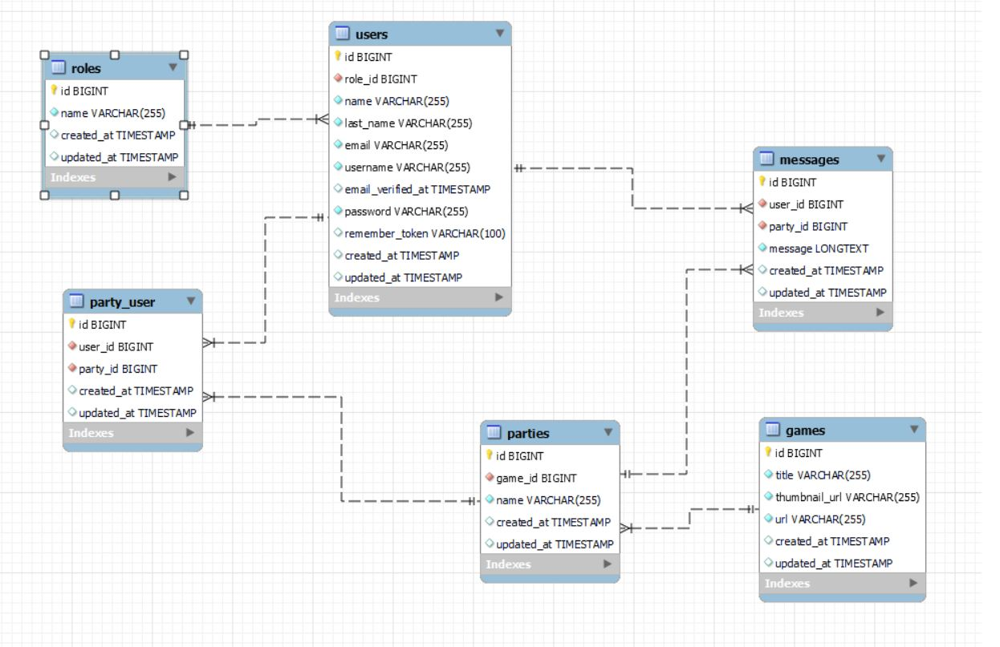
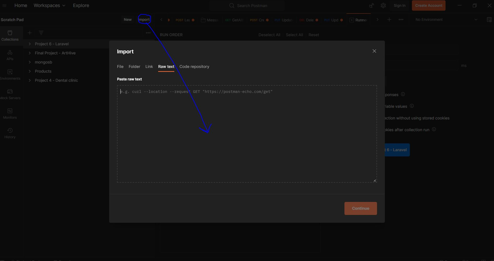

# Project 6 - Backend for a Gaming-Discord-Based with Laravel
<details>
  <summary>Summary 📝</summary>
  <ol>
    <li><a href="#objetivo">Goal</a></li>
    <li><a href="#sobre-el-proyecto">About</a></li>
    <li><a href="#stack">Stack</a></li>
    <li><a href="#diagrama-bd">Diagram</a></li>
    <li><a href="#instalación-en-local">Installation</a></li>
    <li><a href="#work-flow">Work-flow</a></li>
    <li><a href="#endpoints">Endpoints</a></li>
    <li><a href="#futuras-funcionalidades">Future funtionalities</a></li>
    <li><a href="#licencia">Licence</a></li>
    <li><a href="#webgrafia">webography</a></li>
    <li><a href="#desarrollo">Development</a></li>
    <li><a href="#contacto">Contact</a></li>
  </ol>
</details>

## Goal
In this project from our Full Stack Bootcamp with Geekshubs we are asked to show our knowledge adquired during our lessons about PHP + Laravel. We have to create a complete Backend structure (DDBB+PHP+Laravel) that meets the requirements described below. 

## About
Our client asks for a platform where all their employees working remotely can use as a space to meet up and stay in contact, allowing them to interact creating different groups based on their interests.

First stage for the project would be to create a web application LFG that allows employees to contact their colleagues and form groups to play a videogame, to get them to share relax afterwork times.

## Stack
Used technologies:

<div align="center">

<a href="https://php.net/">
    
</a>
<a href="https://laravel.com/">
    
</a>
<a href="https://www.mysql.com/">
    
</a>
<a href="https://git-scm.com/">
    
</a>
<a href="https://www.docker.com/">
    
</a>
<a href=" https://www.postman.com/">
    
</a>

 </div>


## DDBB diagram


## Local installation

1. Clone the repository in a terminal in your computer:
https://github.com/RamonFolguera/rfc-geekshubs-fsd-val-project6-16042023.git
2. ` $ composer install ` To install all dependencies needed.
3. Connect my repo with the database with .env file. You just have to rename the file .env.example to .env and change the configuration to match your Docker one.
4. ``` $ php artisan migrate ``` To execute migrations.
5. ``` $ php artisan db:seed ``` To execute seeders.
5. ``` $ php artisan migrate:fresh --seed ``` In case you need to drop data base and create, excute migrations and seeders again.
6. ``` $ php artisan serve ``` 
7. Ready to test the endpoints in Postman. Here you have my Collection in JSON format:
<details>
<summary>Project 6 - Laravel will be exported as a JSON file 📝</summary>
{
	"info": {
		"_postman_id": "e9501af7-cd90-4194-b5b7-aaba70da1431",
		"name": "Project 6 - Laravel",
		"schema": "https://schema.getpostman.com/json/collection/v2.1.0/collection.json"
	},
	"item": [
		{
			"name": "Users",
			"item": [
				{
					"name": "Get my profile",
					"protocolProfileBehavior": {
						"disableBodyPruning": true,
						"disabledSystemHeaders": {
							"accept": true
						}
					},
					"request": {
						"auth": {
							"type": "bearer",
							"bearer": [
								{
									"key": "token",
									"value": "8|029TWlGt2bxZJNUX9Jj775DKsBg1aVua7q1o38ci",
									"type": "string"
								}
							]
						},
						"method": "GET",
						"header": [
							{
								"key": "Accept",
								"value": "application/json",
								"type": "default"
							}
						],
						"body": {
							"mode": "raw",
							"raw": "",
							"options": {
								"raw": {
									"language": "json"
								}
							}
						},
						"url": {
							"raw": "localhost:8000/api/my-profile/",
							"host": [
								"localhost"
							],
							"port": "8000",
							"path": [
								"api",
								"my-profile",
								""
							]
						}
					},
					"response": []
				},
				{
					"name": "Update my profile",
					"protocolProfileBehavior": {
						"disableBodyPruning": true,
						"disabledSystemHeaders": {
							"accept": true
						}
					},
					"request": {
						"auth": {
							"type": "bearer",
							"bearer": [
								{
									"key": "token",
									"value": "8|029TWlGt2bxZJNUX9Jj775DKsBg1aVua7q1o38ci",
									"type": "string"
								}
							]
						},
						"method": "GET",
						"header": [
							{
								"key": "Accept",
								"value": "application/json",
								"type": "default"
							}
						],
						"body": {
							"mode": "raw",
							"raw": "",
							"options": {
								"raw": {
									"language": "json"
								}
							}
						},
						"url": {
							"raw": "localhost:8000/api/my-profile/",
							"host": [
								"localhost"
							],
							"port": "8000",
							"path": [
								"api",
								"my-profile",
								""
							]
						}
					},
					"response": []
				},
				{
					"name": "Get All users by Admin",
					"request": {
						"method": "GET",
						"header": [],
						"url": {
							"raw": "localhost:8000/api/register/",
							"host": [
								"localhost"
							],
							"port": "8000",
							"path": [
								"api",
								"register",
								""
							]
						}
					},
					"response": []
				}
			]
		},
		{
			"name": "Auth",
			"item": [
				{
					"name": "Register",
					"request": {
						"method": "POST",
						"header": [],
						"body": {
							"mode": "raw",
							"raw": "{\r\n    \"name\": \"Peter\",\r\n    \"last_name\": \"Roger\",\r\n    \"username\": \"nickname\",\r\n    \"email\": \"peter@peter.com\",\r\n    \"password\": \"123456\"\r\n}",
							"options": {
								"raw": {
									"language": "json"
								}
							}
						},
						"url": {
							"raw": "localhost:8000/api/register/",
							"host": [
								"localhost"
							],
							"port": "8000",
							"path": [
								"api",
								"register",
								""
							]
						}
					},
					"response": []
				},
				{
					"name": "Logout",
					"request": {
						"method": "POST",
						"header": [],
						"body": {
							"mode": "raw",
							"raw": "{\r\n    \"email\": \"alex@alex.com\",\r\n    \"password\": \"password456\"\r\n}",
							"options": {
								"raw": {
									"language": "json"
								}
							}
						},
						"url": {
							"raw": "localhost:8000/api/login/",
							"host": [
								"localhost"
							],
							"port": "8000",
							"path": [
								"api",
								"login",
								""
							]
						}
					},
					"response": []
				},
				{
					"name": "Login",
					"request": {
						"method": "POST",
						"header": [],
						"body": {
							"mode": "raw",
							"raw": "{\r\n    \"email\": \"alex@alex.com\",\r\n    \"password\": \"password456\"\r\n}",
							"options": {
								"raw": {
									"language": "json"
								}
							}
						},
						"url": {
							"raw": "localhost:8000/api/login/",
							"host": [
								"localhost"
							],
							"port": "8000",
							"path": [
								"api",
								"login",
								""
							]
						}
					},
					"response": []
				}
			]
		},
		{
			"name": "Parties",
			"item": [
				{
					"name": "Create Party",
					"request": {
						"method": "POST",
						"header": [],
						"body": {
							"mode": "raw",
							"raw": "{\r\n    \"game_id\": 1,\r\n    \"name\": \"RamonParty\"\r\n}",
							"options": {
								"raw": {
									"language": "json"
								}
							}
						},
						"url": {
							"raw": "localhost:8000/api/party/",
							"host": [
								"localhost"
							],
							"port": "8000",
							"path": [
								"api",
								"party",
								""
							]
						}
					},
					"response": []
				},
				{
					"name": "Get all parties playing a Game",
					"protocolProfileBehavior": {
						"disableBodyPruning": true,
						"disabledSystemHeaders": {
							"accept": true
						}
					},
					"request": {
						"method": "GET",
						"header": [
							{
								"key": "Accept",
								"value": "application/json",
								"type": "default"
							}
						],
						"body": {
							"mode": "raw",
							"raw": "",
							"options": {
								"raw": {
									"language": "json"
								}
							}
						},
						"url": {
							"raw": "localhost:8000/api/partiesByGameId/2",
							"host": [
								"localhost"
							],
							"port": "8000",
							"path": [
								"api",
								"partiesByGameId",
								"2"
							]
						}
					},
					"response": []
				},
				{
					"name": "Join a Party",
					"request": {
						"auth": {
							"type": "bearer",
							"bearer": [
								{
									"key": "token",
									"value": "11|flpY4uplQV3wOxlzUezMCfSiMJoT3eWbZVuW7YYT",
									"type": "string"
								}
							]
						},
						"method": "POST",
						"header": [],
						"body": {
							"mode": "raw",
							"raw": "{\r\n    \"party_id\": 1\r\n}",
							"options": {
								"raw": {
									"language": "json"
								}
							}
						},
						"url": {
							"raw": "localhost:8000/api/party/join",
							"host": [
								"localhost"
							],
							"port": "8000",
							"path": [
								"api",
								"party",
								"join"
							]
						}
					},
					"response": []
				},
				{
					"name": "Leave a Party",
					"request": {
						"auth": {
							"type": "bearer",
							"bearer": [
								{
									"key": "token",
									"value": "11|flpY4uplQV3wOxlzUezMCfSiMJoT3eWbZVuW7YYT",
									"type": "string"
								}
							]
						},
						"method": "POST",
						"header": [],
						"body": {
							"mode": "raw",
							"raw": "{\r\n    \"party_id\": 1\r\n}",
							"options": {
								"raw": {
									"language": "json"
								}
							}
						},
						"url": {
							"raw": "localhost:8000/api/party/join",
							"host": [
								"localhost"
							],
							"port": "8000",
							"path": [
								"api",
								"party",
								"join"
							]
						}
					},
					"response": []
				}
			]
		},
		{
			"name": "Messages",
			"item": [
				{
					"name": "GetAllMessagesByPartyId",
					"protocolProfileBehavior": {
						"disabledSystemHeaders": {
							"accept": true
						}
					},
					"request": {
						"auth": {
							"type": "bearer",
							"bearer": [
								{
									"key": "token",
									"value": "2|IP9D1KYxSPaZVLyzaAgScbcLXk75j4FiOKlMBKir",
									"type": "string"
								}
							]
						},
						"method": "GET",
						"header": [
							{
								"key": "Accept",
								"value": "application/json",
								"type": "default"
							}
						],
						"url": {
							"raw": "localhost:8000/api/messages/party/1",
							"host": [
								"localhost"
							],
							"port": "8000",
							"path": [
								"api",
								"messages",
								"party",
								"1"
							]
						}
					},
					"response": []
				},
				{
					"name": "Create Message",
					"protocolProfileBehavior": {
						"disabledSystemHeaders": {
							"accept": true
						}
					},
					"request": {
						"method": "POST",
						"header": [
							{
								"key": "Accept",
								"value": "application/json",
								"type": "default"
							}
						],
						"body": {
							"mode": "raw",
							"raw": "{\r\n    \"party_id\": 1,\r\n    \"message\": \"What's up guys?\"\r\n}",
							"options": {
								"raw": {
									"language": "json"
								}
							}
						},
						"url": {
							"raw": "localhost:8000/api/messages/new",
							"host": [
								"localhost"
							],
							"port": "8000",
							"path": [
								"api",
								"messages",
								"new"
							]
						}
					},
					"response": []
				},
				{
					"name": "Update Message",
					"protocolProfileBehavior": {
						"disabledSystemHeaders": {
							"accept": true
						}
					},
					"request": {
						"auth": {
							"type": "bearer",
							"bearer": [
								{
									"key": "token",
									"value": "2|IP9D1KYxSPaZVLyzaAgScbcLXk75j4FiOKlMBKir",
									"type": "string"
								}
							]
						},
						"method": "PUT",
						"header": [
							{
								"key": "Accept",
								"value": "application/json",
								"type": "default"
							}
						],
						"body": {
							"mode": "raw",
							"raw": "{\r\n    \"message\": \"que pasa cara pasa\"\r\n}",
							"options": {
								"raw": {
									"language": "json"
								}
							}
						},
						"url": {
							"raw": "localhost:8000/api/messages/1",
							"host": [
								"localhost"
							],
							"port": "8000",
							"path": [
								"api",
								"messages",
								"1"
							]
						}
					},
					"response": []
				},
				{
					"name": "Delete Message",
					"protocolProfileBehavior": {
						"disabledSystemHeaders": {
							"accept": true
						}
					},
					"request": {
						"auth": {
							"type": "bearer",
							"bearer": [
								{
									"key": "token",
									"value": "2|IP9D1KYxSPaZVLyzaAgScbcLXk75j4FiOKlMBKir",
									"type": "string"
								}
							]
						},
						"method": "DELETE",
						"header": [
							{
								"key": "Accept",
								"value": "application/json",
								"type": "default"
							}
						],
						"body": {
							"mode": "raw",
							"raw": "{\r\n    \"message\": \"how are you guys?\"\r\n}",
							"options": {
								"raw": {
									"language": "json"
								}
							}
						},
						"url": {
							"raw": "localhost:8000/api/messages/1",
							"host": [
								"localhost"
							],
							"port": "8000",
							"path": [
								"api",
								"messages",
								"1"
							]
						}
					},
					"response": []
				}
			]
		}
	]
}
</details>

Copy that JSON and paste it in here:

image.png

## Endpoints
<details>
<summary>Endpoints</summary>

- AUTH
    - USERS REGISTER

            POST http://localhost:8000/api/register/
        body:
        ``` js
            
          {
            "name": "James",
            "last_name": "Webb",
            "username": "RockyRock",
            "email": "james@james.com",
            "password": "999999"
          }
        ```

    - USERS LOGIN

            POST http://localhost:8000/api/login/  
        body:
        ``` js
        {
            "email": "alex@alex.com",
            "password": "123456"
        }
        ```

    - USERS LOGOUT

            POST http://localhost:8000/api/logout/  

- USER
    - USER PROFILE 

        Copy the generated TOKEN generado with authenticate from LOGIN:


        ```
            "1|GmWPYpZbnEKrKpqHPh6Z2oFxl14oQxMaPKpJexYX"
        ```

        In AUTHORIZATION. Type BEARER TOKEN. Paste the generated TOKEN.

            GET http://localhost:8000/api/my-profile/

        

    - USER PROFILE DETAILS UPDATE 

        Copy the generated TOKEN generado with authenticate from LOGIN:

        ```
            "1|GmWPYpZbnEKrKpqHPh6Z2oFxl14oQxMaPKpJexYX"
        ```

        In AUTHORIZATION. Type BEARER TOKEN. Paste the generated TOKEN.

            PUT http://localhost:8000/api/my-profile/update
        body:
        ``` js
            {
            "name": "Alex updated",
            "last_name": "Moya updated",
            "username": "updated",
            "email": "alex@gmailupdated.com",
            "password": "123456"
            }
        ```

    - GET ALL REGISTERED USERS AS ADMIN

        LOGIN as USER with ADMIN role:

        body:
        ``` js
            {
                "email": "alex@alex.com",
                "password": "123456"
            }
        ```

        Copy the generated TOKEN generado with authenticate from LOGIN:


        ```
            "1|GmWPYpZbnEKrKpqHPh6Z2oFxl14oQxMaPKpJexYX"
        ```

        In AUTHORIZATION. Type BEARER TOKEN. Paste the generated TOKEN.

            GET  http://localhost:8000/api/users/all

- PARTY
    - CREATE PARTIES

            POST http://localhost:8000/api/party/
        body:
        ``` js
            {
                "game_id": 4,
                "name": "NewParty"
            }
        ```

    - GET ALL PARTIES PLAYING A SPECIFIC GAME

        Adding id from the selected game by params (/id).

            GET http://localhost:8000/api/partiesByGameId/2

    - JOIN A PARTY

        Copy the generated TOKEN generado with authenticate from LOGIN:

        ```
            "1|GmWPYpZbnEKrKpqHPh6Z2oFxl14oQxMaPKpJexYX"
        ```

        In AUTHORIZATION. Type BEARER TOKEN. Paste the generated TOKEN.


            POST http://localhost:8000/api/party/join
        body:
        ``` js
            {
                "party_id": 4
            }
        ```

    - LEAVE A PARTY

        Copy the generated TOKEN generado with authenticate from LOGIN:

        ```
            "1|GmWPYpZbnEKrKpqHPh6Z2oFxl14oQxMaPKpJexYX"
        ```

        In AUTHORIZATION. Type BEARER TOKEN. Paste the generated TOKEN.


            POST http://localhost:8000/api/party/leave
        body:
        ``` js
            {
                "party_id": 4
            }
        ```
    
- MESSAGES
    - GET ALL MESSAGES IN A PARTY

        Copy the generated TOKEN generado with authenticate from LOGIN:

        ```
            "1|GmWPYpZbnEKrKpqHPh6Z2oFxl14oQxMaPKpJexYX"
        ```

        In AUTHORIZATION. Type BEARER TOKEN. Paste the generated TOKEN.

        Adding id from the selected party by params (/id).

            GET  http://localhost:8000/api/messages/party/1


    - CREATE NEW MESSAGES

        Copy the generated TOKEN generado with authenticate from LOGIN:

        ```
            "1|GmWPYpZbnEKrKpqHPh6Z2oFxl14oQxMaPKpJexYX"
        ```

        In AUTHORIZATION. Type BEARER TOKEN. Paste the generated TOKEN.


            POST http://localhost:8000/api/messages/new
        body:
        ``` js
            {
                "party_id": 1,
                 "message": "Whats up guys?"
            }
        ```

- UPDATE MESSAGES

        Copy the generated TOKEN generado with authenticate from LOGIN:

        ```
            "1|GmWPYpZbnEKrKpqHPh6Z2oFxl14oQxMaPKpJexYX"
        ```

        In AUTHORIZATION. Type BEARER TOKEN. Paste the generated TOKEN.

        Adding id from the selected message by params (/id)

            PUT http://localhost:8000/api/messages/1
        body:
       ``` js
            {
                "message": "Whats up guys?"
            }
        ```      

- DELETE MESSAGES

        Copy the generated TOKEN generado with authenticate from LOGIN:

        ```
            "1|GmWPYpZbnEKrKpqHPh6Z2oFxl14oQxMaPKpJexYX"
        ```

        In AUTHORIZATION. Type BEARER TOKEN. Paste the generated TOKEN.

        Adding id from the selected message by params (/id)

            DELETE http://localhost:8000/api/messages/1
         
</details>


## Licencia
This project is under the following license [MIT License](https://github.com/RamonFolguera/rfc-geekshubs-fsd-val-project6-16042023/blob/master/LICENSE).

## Webography:
To finish this project I have used the following documentation:
- [Laravel documentation](https://laravel.com/docs/9.x)


## Development:

``` js
  console.log("Developed by: " + Ramón Folguera Carbonell);
```  

Project made by:

- **Ramón**
<a href="https://github.com/RamonFolguera" target="_blank"></a>

##Contacto
- **Ramón**
<a href = "mailto:folguera.ramon@gmail.com"></a>
<a href="https://www.linkedin.com/in/ram%C3%B3n-folguera-0ab32776/" target="_blank"></a> 
</p>

## Thanks:

I want to thank my GeekHub mentors for all the support they have given us everyday. For this particular project thanks to:

- **Dani**  
<a href="https://github.com/datata" target="_blank"></a> 


